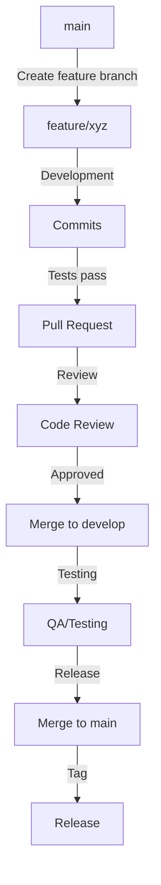
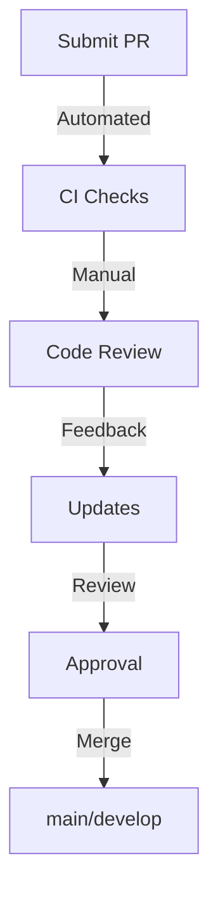

# Development Guidelines

## Code Standards

### Rust Guidelines
- Follow the official Rust style guide
- Use `cargo fmt` and `clippy` before commits
- Implement comprehensive error handling
- Write detailed documentation for public APIs
- Maintain test coverage above 80%

### TypeScript Guidelines (VS Code Extension)
- Follow Microsoft's TypeScript guidelines
- Use ESLint with recommended settings
- Implement strict null checks
- Document all public interfaces
- Write unit tests for all components

## Git Workflow



### Branch Naming
- `feature/*`: New features
- `fix/*`: Bug fixes
- `docs/*`: Documentation updates
- `refactor/*`: Code refactoring
- `test/*`: Test improvements

### Commit Messages
```
<type>(<scope>): <subject>

<body>

<footer>
```

Types:
- feat: New feature
- fix: Bug fix
- docs: Documentation
- style: Formatting
- refactor: Code restructuring
- test: Tests
- chore: Maintenance

Example:
```
feat(memory): implement predictive loading

- Add pattern recognition system
- Implement cache preloading
- Add performance metrics

Closes #123
```

## Testing Requirements

### Unit Tests
- Required for all new features
- Must cover edge cases
- Include performance benchmarks
- Document test scenarios

### Integration Tests
- End-to-end workflow testing
- Cross-component interaction tests
- Performance regression tests
- Memory leak detection

### Performance Testing
- Latency measurements
- Memory usage tracking
- Token optimization metrics
- Scalability tests

## Documentation Rules

### API Documentation
- Clear method descriptions
- Parameter documentation
- Return value specifications
- Example usage
- Error scenarios

### Architecture Documentation
- Component diagrams
- Interaction flows
- Data structures
- Design decisions

### User Documentation
- Installation guide
- Configuration options
- Usage examples
- Troubleshooting

## Code Review Process



### Review Checklist
1. Code quality
   - Follows style guide
   - Clear and maintainable
   - Properly documented

2. Testing
   - Unit tests added
   - Integration tests updated
   - Test coverage maintained

3. Performance
   - No performance regressions
   - Memory usage optimized
   - Token efficiency

4. Security
   - No sensitive data
   - Proper error handling
   - Input validation

## Release Process

1. Version Bump
   - Update version numbers
   - Update changelog
   - Update documentation

2. Testing
   - Run full test suite
   - Perform manual testing
   - Check documentation

3. Release
   - Create release branch
   - Tag version
   - Update release notes

4. Deploy
   - Publish to VS Code Marketplace
   - Update documentation site
   - Announce release