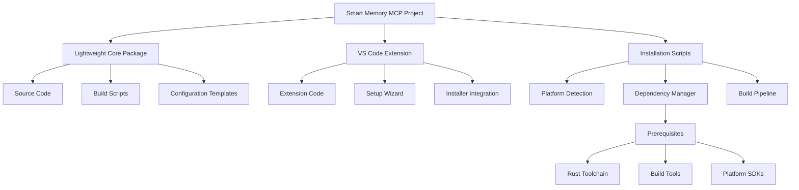
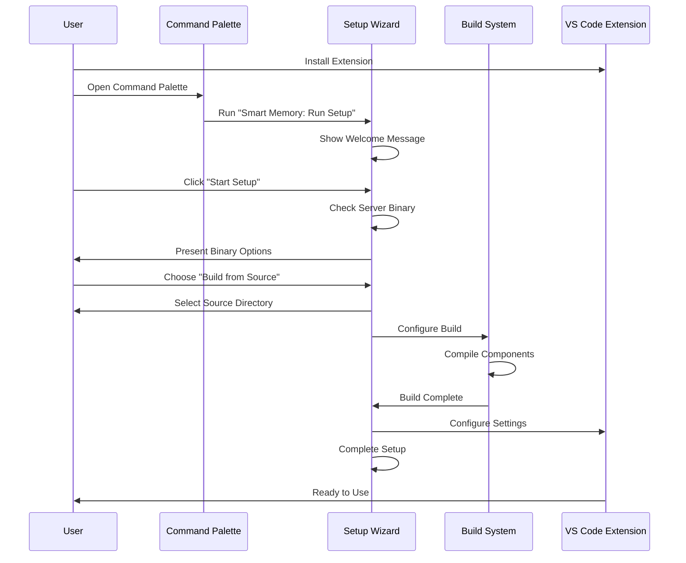

# Component-Based Deployment Strategy

## Overview
This document outlines the new deployment strategy for Smart Memory MCP, transitioning from pre-compiled binaries to a source-based installation approach with component-based architecture.

## Architecture



## Installation Flow



The actual installation process now uses the VS Code command palette and setup wizard:

1. User installs the extension from VS Code marketplace
2. User opens the command palette (Ctrl+Shift+P/Cmd+Shift+P)
3. User runs "Smart Memory: Run Setup" command
4. Setup wizard guides through the process:
   - Welcome message and setup initialization
   - Server binary options (including build from source)
   - Source directory selection
   - Build process monitoring
   - Configuration and settings
5. Extension is ready to use after setup completion

## Key Components

### 1. Smart Install Script
- Environment detection and validation
- Prerequisite installation (Rust, build tools)
- Cross-platform compatibility handling
- Build configuration management

### 2. Progressive Component Installation
- Core server (required)
  - Source-based compilation
  - Platform-specific optimizations
  - Minimal dependencies
- Client library (optional)
  - On-demand compilation
  - Language-specific bindings
- Additional tools (as needed)
  - Plugin system
  - Extension support

### 3. Configuration Management
- Environment-specific templates
- Dynamic path configuration
- User preferences preservation
- Validation and verification

### 4. Update System
- Source-based updates
- Incremental rebuilds
- Configuration migration
- Dependency management

## Directory Structure

```
smart-memory-mcp/
├── core/
│   ├── src/
│   ├── Cargo.toml
│   └── build.rs
├── client/
│   ├── src/
│   ├── Cargo.toml
│   └── build.rs
├── extension/
│   ├── src/
│   ├── package.json
│   └── setup/
│       ├── installer.ts
│       └── wizard.ts
├── scripts/
│   ├── install.sh
│   ├── install.ps1
│   └── setup-dev.sh
└── config/
    ├── templates/
    └── defaults/
```

## Implementation Plan

### Phase 1: Repository Cleanup
1. Remove pre-compiled binaries
2. Update .gitignore for build artifacts
3. Clean up existing target directories
4. Document build requirements

### Phase 2: Installer Development
1. Create smart installation scripts
2. Implement environment detection
3. Add prerequisite installation
4. Develop build configuration system

### Phase 3: VS Code Integration
1. Update extension packaging
2. Integrate installer with extension
3. Implement setup wizard
4. Add progress monitoring

### Phase 4: Testing & Documentation
1. Test cross-platform builds
2. Verify dependency handling
3. Document installation process
4. Create troubleshooting guide

## Benefits
- Reduced repository size
- Platform-optimized builds
- Flexible deployment options
- Better development experience
- Simplified maintenance

## Migration Strategy
1. Create new installation scripts
2. Test with existing users
3. Phase out pre-compiled binaries
4. Update documentation
5. Release new version

## Next Steps
1. Create detailed implementation specifications
2. Develop proof-of-concept installer
3. Test cross-platform compatibility
4. Document user migration process
