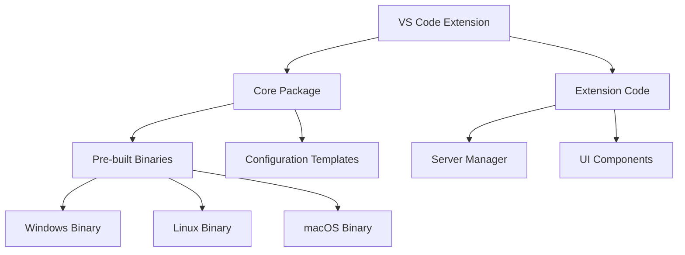
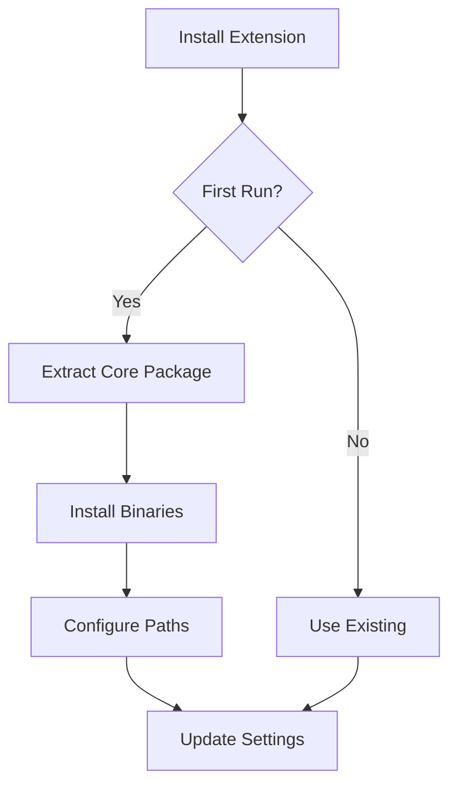

# Smart Memory MCP Packaging Strategy

## Current Issues
1. Project relies on git clone for installation
2. Core binary location is unpredictable
3. Configuration is tied to development paths
4. No standardized installation process

## Proposed Solution

### Package Structure


### Installation Flow


## Implementation Plan

### 1. Core Package Structure
```
smart-memory-mcp/
├── bin/
│   ├── windows/smart-memory-mcp-core.exe
│   ├── linux/smart-memory-mcp-core
│   └── macos/smart-memory-mcp-core
├── config/
│   ├── server-config.json
│   └── client-config.json
└── README.md
```

### 2. VS Code Extension Changes
- Bundle core binaries with extension
- Install into `.vscode/extensions/smart-memory-mcp/`
- Use extension storage for user data:
  ```
  {userHome}/.vscode/extensions/smart-memory-mcp-{version}/
  ├── bin/
  ├── data/
  │   ├── memories.db
  │   └── config.json
  └── logs/
  ```

### 3. Installation Process
1. Install extension from VS Code marketplace
2. During first activation:
   - Extract appropriate binary for platform
   - Create data directory structure
   - Initialize configuration files
   - Set up default paths

### 4. Configuration Management
1. Use extension context path:
```typescript
const extensionPath = context.extensionPath;
const dataPath = context.globalStoragePath;
const binaryPath = path.join(extensionPath, 'bin', getPlatformBinary());
const configPath = path.join(dataPath, 'config.json');
const dbPath = path.join(dataPath, 'memories.db');
```

2. Store user preferences in VS Code settings:
```json
{
  "smartMemory.dataLocation": "default",
  "smartMemory.customBinaryPath": null,
  "smartMemory.customDataPath": null
}
```

### 5. Development Workflow
1. Build process:
   ```bash
   # Build core binaries for all platforms
   cargo build --release --target x86_64-pc-windows-gnu
   cargo build --release --target x86_64-unknown-linux-gnu
   cargo build --release --target x86_64-apple-darwin

   # Package extension
   vsce package
   ```

2. Development/Production modes:
   - Development: Use local cargo build
   - Production: Use bundled binaries

### Benefits
1. Simplified installation (one-click from VS Code)
2. Predictable binary locations
3. Platform-independent configuration
4. Proper separation of extension and user data
5. Better development/production parity

### Migration Strategy
1. Add packaging scripts
2. Update extension to use bundled binaries
3. Preserve support for development mode
4. Add migration for existing installations

### Next Steps
1. Create build pipeline for cross-platform binaries
2. Update extension packaging to include binaries
3. Implement automated binary selection
4. Add configuration migration tool
