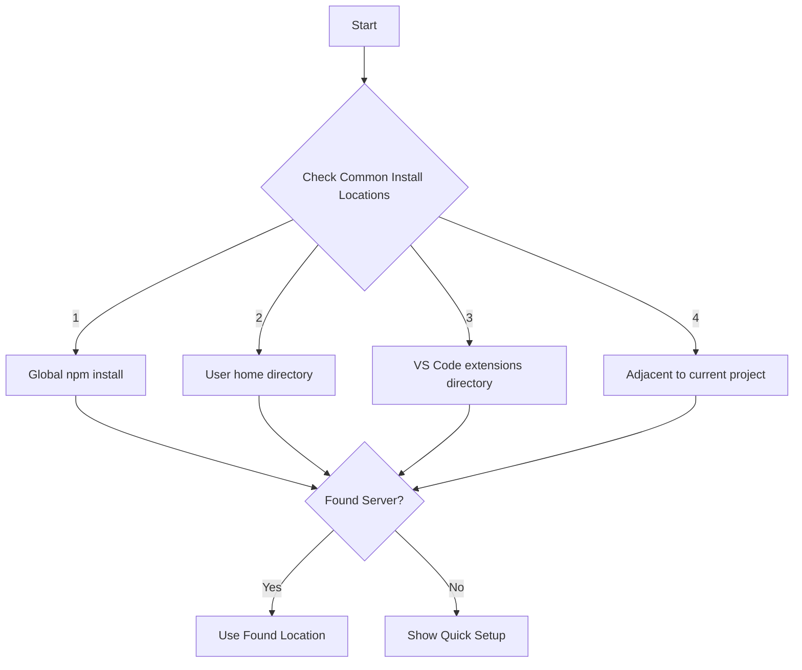
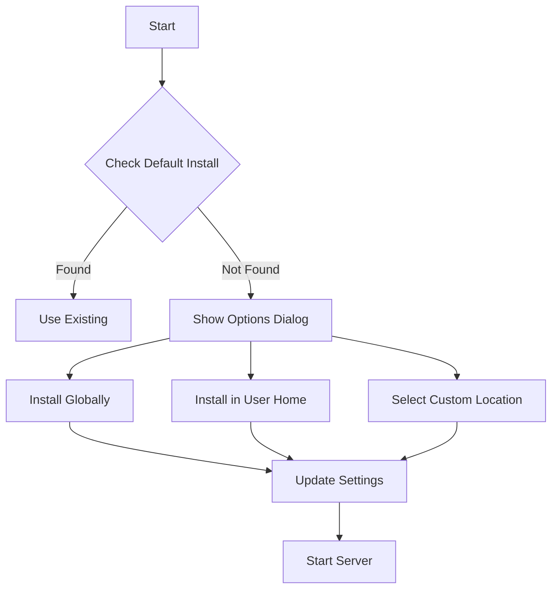

# Smart Memory MCP Server Discovery Design

## Current Issues
1. Users need to know where the server is installed
2. Configuration has to be manually updated with correct paths
3. Server discovery across different projects is problematic
4. First-run experience is not user-friendly

## Proposed Solution

### Server Discovery Strategy

### Quick Setup Flow

## Implementation Plan

### 1. Server Location Resolution
- Create a prioritized list of common install locations:
  1. Global npm installation (`~/.npm-global/bin/smart-memory-mcp-core`)
  2. User home directory (`~/.smart-memory/bin/smart-memory-mcp-core`)
  3. VS Code extensions directory (`~/.vscode/extensions/smart-memory-mcp-extension/bin/smart-memory-mcp-core`)
  4. Adjacent to current project (`./node_modules/.bin/smart-memory-mcp-core`)
- Add detection logic to find the server binary
- Cache the found location in VS Code settings

### 2. Auto-Configuration
- When a server location is found:
  - Automatically update all paths to be absolute
  - Store server location preference in user settings
  - Generate required directory structure if missing

### 3. First-Run Experience
- Add a quick setup wizard:
  1. Display welcome message explaining Smart Memory MCP
  2. Check for existing installations
  3. If not found, show installation options:
     - Install globally (recommended)
     - Install in user home
     - Select custom location
  4. Guide through initial configuration
  5. Validate installation

### 4. Ongoing Management
- Add commands:
  - Change server location
  - Repair server installation
  - Reset server configuration
- Add status bar indicators:
  - Server availability
  - Memory bank status
- Provide quick actions for common tasks

## Benefits
- Users don't need to manually configure paths
- Works across different projects automatically
- Clear guidance for new users
- Flexible for advanced users
- More reliable server discovery

## Technical Implementation Notes

### VS Code Extension Changes
1. New classes:
   - `ServerDiscovery`: Handles finding and validating server installations
   - `ServerManager`: Manages server lifecycle and configuration
   - `SetupWizard`: Handles first-run experience

2. Configuration changes:
   - Add server location preference
   - Add auto-discovery settings
   - Add quick setup completion flag

3. UI improvements:
   - Add setup wizard webview
   - Add server status notifications
   - Add configuration commands

### MCP Server Changes
1. New endpoints:
   - Health check endpoint
   - Version check endpoint
   - Configuration validation endpoint

2. Configuration updates:
   - Support for configuration validation
   - Improved error messaging
   - Path normalization

## Migration Strategy
1. Detect existing installations
2. Normalize all paths to absolute
3. Update configuration format
4. Preserve user preferences
5. Provide rollback option