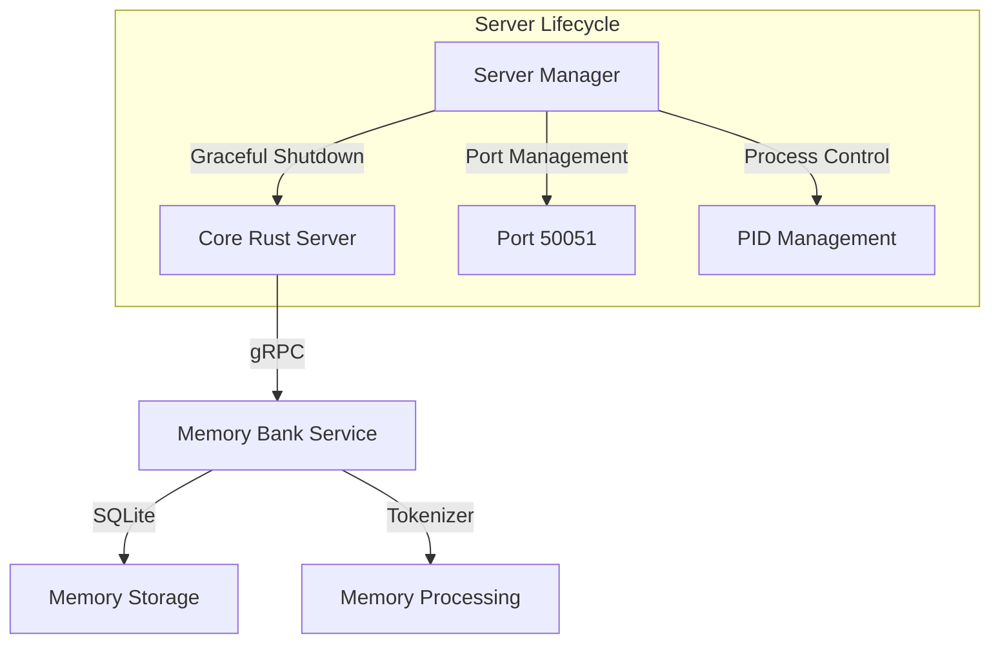
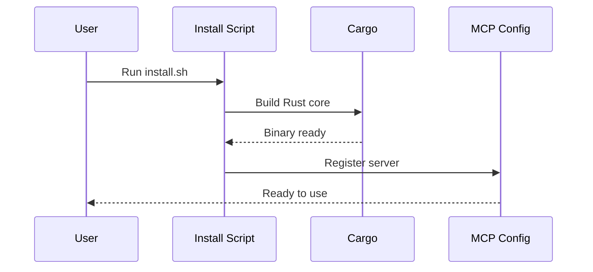

# Simplified Smart Memory MCP Implementation Plan

## Overview

A streamlined approach to implementing the Smart Memory MCP server, focusing on core functionality and proper lifecycle management.



## Core Components

### 1. Rust MCP Server
- Focus on essential gRPC service implementation
- Clean process management and signal handling
- Proper port handling and connection management
- SQLite-based memory storage

### 2. Memory Bank Service
- Tokenized memory storage and retrieval
- Basic memory categorization (context, decision, progress)
- Simple relevance scoring based on categories
- Token usage tracking and optimization

### 3. Server Lifecycle Management
- Clean shutdown on VS Code exit
- Detection and connection to existing server
- Port conflict resolution
- Process cleanup

## Implementation Steps

### Phase 1: Core Server Cleanup
1. Remove extension-specific code
2. Update server shutdown handling
3. Implement proper signal handling
4. Add port availability checking
5. Setup PID file management

### Phase 2: Memory Bank Essentials
1. Streamline memory storage schema
2. Implement basic tokenization
3. Add memory categorization
4. Setup token tracking

### Phase 3: MCP Integration
1. Configure MCP server registration
2. Setup proper installation flow
3. Test server lifecycle
4. Verify memory operations

## Installation Flow



## Technical Details

### Server Configuration
```json
{
    "mcpServers": {
        "smart-memory": {
            "command": "/path/to/smart-memory-mcp-core",
            "args": [],
            "env": {
                "RUST_LOG": "info",
                "DB_PATH": "${userHome}/.smart-memory/db/memories.db"
            },
            "disabled": false,
            "alwaysAllow": []
        }
    }
}
```

### Memory Schema
```sql
CREATE TABLE memories (
    id TEXT PRIMARY KEY,
    category TEXT NOT NULL,
    content TEXT NOT NULL,
    tokens INTEGER NOT NULL,
    timestamp DATETIME DEFAULT CURRENT_TIMESTAMP,
    metadata TEXT
);

CREATE INDEX idx_category_timestamp ON memories(category, timestamp);
```

### Process Management
1. Write PID file on startup
2. Handle SIGTERM/SIGINT gracefully
3. Remove PID file on shutdown
4. Check PID file on startup

### Port Management
1. Check port availability
2. Attempt connection to existing server
3. Handle port conflicts gracefully
4. Release port on shutdown

## Benefits
1. Simplified architecture
2. Reliable server lifecycle
3. Clean process management
4. Focused functionality
5. Easy maintenance

## Success Criteria
- [x] Server starts and stops cleanly
- [x] Memory operations work reliably
- [x] Port conflicts are handled gracefully
- [x] Process cleanup is thorough
- [x] Token tracking is accurate