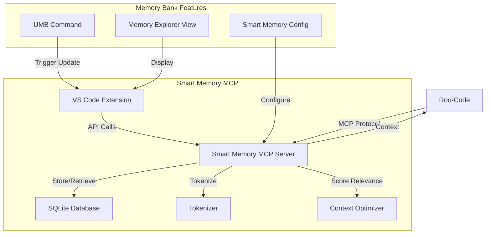
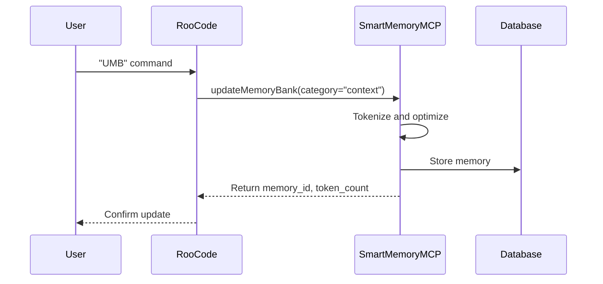
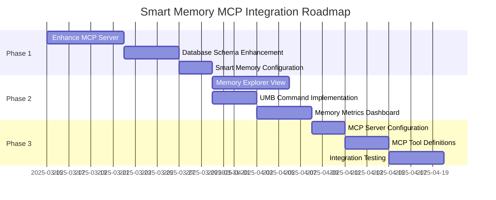

# Smart Memory MCP Integration with Roo-Code

This document outlines the plan for integrating Smart Memory MCP with Roo-Code as an MCP server, providing enhanced memory management capabilities with smart tokenization, context relevance, and optimization.

## Architecture Overview



## Implementation Plan

### Phase 1: Core MCP Server Implementation

1. **Enhance MCP Server for Memory Bank Operations**
   - Add specific MCP tools for memory bank operations:
     - `storeMemory`: Store a memory with category, content, and metadata
     - `getContext`: Retrieve context based on mode and relevance
     - `optimizeMemory`: Optimize memory usage to reduce tokens
     - `getMemoryStats`: Get statistics about memory usage
   - Implement memory categorization by type (context, decision, progress, etc.)
   - Add date-based organization and filtering

2. **Database Schema Enhancement**
   - Extend the current schema to support memory bank categories:
     - Add `category` field to memories (context, decision, progress, etc.)
     - Add `date` field for organizing memories by date
     - Add `mode` field for mode-specific memories
   - Implement efficient querying by category, date, and relevance

3. **Smart Memory Configuration**
   - Create a new configuration format specific to Smart Memory MCP:
     ```json
     {
       "memory_bank": {
         "categories": {
           "context": { "max_tokens": 10000, "priority": "high" },
           "decision": { "max_tokens": 5000, "priority": "medium" },
           "progress": { "max_tokens": 8000, "priority": "high" },
           "product": { "max_tokens": 10000, "priority": "medium" },
           "pattern": { "max_tokens": 5000, "priority": "low" }
         },
         "update_triggers": {
           "auto_update": true,
           "umb_command": true
         },
         "token_budget": {
           "total": 50000,
           "per_category": true
         },
         "relevance": {
           "threshold": 0.7,
           "boost_recent": true
         }
       }
     }
     ```

### Phase 2: VS Code Extension Enhancement

1. **Memory Explorer View**
   - Implement a tree view for browsing memories by category and date
   - Add search and filter functionality
   - Provide memory details view with token count and relevance score
   - Add actions for editing, deleting, and optimizing memories

2. **UMB Command Implementation**
   - Add command palette entry for "Update Memory Bank" (UMB)
   - Implement automatic updates after significant changes
   - Add configuration option to control update frequency
   - Provide visual feedback during updates

3. **Memory Metrics Dashboard**
   - Add a dashboard for viewing memory usage statistics
   - Display token usage by category and date
   - Show optimization opportunities
   - Track token costs and savings

### Phase 3: MCP Integration with Roo-Code

1. **MCP Server Configuration**
   - Create configuration for Roo-Code's MCP settings:
     ```json
     {
       "mcpServers": {
         "smart-memory": {
           "command": "node",
           "args": ["/path/to/smart-memory-mcp/core/target/release/smart-memory-mcp-core"],
           "env": {
             "RUST_LOG": "info",
             "DB_PATH": "{workspace}/.smart-memory/memories.db",
             "CONFIG_PATH": "{workspace}/.smart-memory/config.json"
           },
           "disabled": false,
           "timeout": 60,
           "alwaysAllow": []
         }
       }
     }
     ```

2. **MCP Tool Definitions**
   - Define tools for Roo-Code to use:
     - `getMemoryBankContext`: Get context from the memory bank
     - `updateMemoryBank`: Update the memory bank with new information
     - `optimizeMemoryBank`: Optimize the memory bank to reduce tokens
     - `getMemoryBankStats`: Get statistics about memory bank usage

3. **Integration Testing**
   - Test the integration with Roo-Code
   - Verify that context is properly retrieved and updated
   - Ensure that mode switching works correctly
   - Validate token counting and optimization

## Technical Details

### Memory Bank Categories

| Category | Description | Default Max Tokens | Priority |
|----------|-------------|-------------------|----------|
| context | Current session state and focus | 10000 | high |
| decision | Technical decisions and rationale | 5000 | medium |
| progress | Work progress and tasks | 8000 | high |
| product | Project overview and knowledge | 10000 | medium |
| pattern | System patterns and standards | 5000 | low |

### MCP Tools API

#### 1. `getMemoryBankContext`

```typescript
interface GetMemoryBankContextInput {
  mode: string;              // Current mode (code, architect, etc.)
  maxTokens?: number;        // Maximum tokens to return
  categories?: string[];     // Categories to include
  relevanceThreshold?: number; // Minimum relevance score
  date?: string;             // Specific date (YYYY-MM-DD)
}

interface GetMemoryBankContextOutput {
  context: string;           // Combined context
  tokenCount: number;        // Total tokens
  relevanceScore: number;    // Average relevance score
  sources: {                 // Source memories
    id: string;
    category: string;
    relevance: number;
  }[];
}
```

#### 2. `updateMemoryBank`

```typescript
interface UpdateMemoryBankInput {
  content: string;           // Content to store
  category: string;          // Category (context, decision, etc.)
  mode?: string;             // Associated mode
  metadata?: Record<string, string>; // Additional metadata
  date?: string;             // Specific date (defaults to today)
}

interface UpdateMemoryBankOutput {
  memoryId: string;          // ID of the stored memory
  tokenCount: number;        // Token count
  category: string;          // Category
  success: boolean;          // Success status
}
```

#### 3. `optimizeMemoryBank`

```typescript
interface OptimizeMemoryBankInput {
  categories?: string[];     // Categories to optimize
  targetTokens?: number;     // Target token count
  strategy?: 'balanced' | 'aggressive' | 'conservative'; // Optimization strategy
}

interface OptimizeMemoryBankOutput {
  tokensBefore: number;      // Tokens before optimization
  tokensAfter: number;       // Tokens after optimization
  tokensSaved: number;       // Tokens saved
  optimizedMemories: number; // Number of memories optimized
}
```

### UMB Command Flow



## Benefits of This Approach

1. **Simplified Architecture**: Direct database usage without translation layers
2. **MCP Integration**: Leverages Roo-Code's existing MCP framework
3. **Enhanced Features**: Smart tokenization, relevance scoring, and optimization
4. **Familiar Workflow**: Maintains UMB command and memory categories
5. **Improved Performance**: Database storage is more efficient than file-based storage
6. **Future-Proof**: The architecture supports adding new features and capabilities

## Implementation Roadmap



## Next Steps

1. Enhance the MCP Server for memory bank operations
2. Extend the database schema to support memory bank categories
3. Create the Smart Memory Configuration format
4. Implement the Memory Explorer View in the VS Code extension
5. Add UMB command handling
6. Configure the MCP server for Roo-Code integration
7. Test the integration with Roo-Code